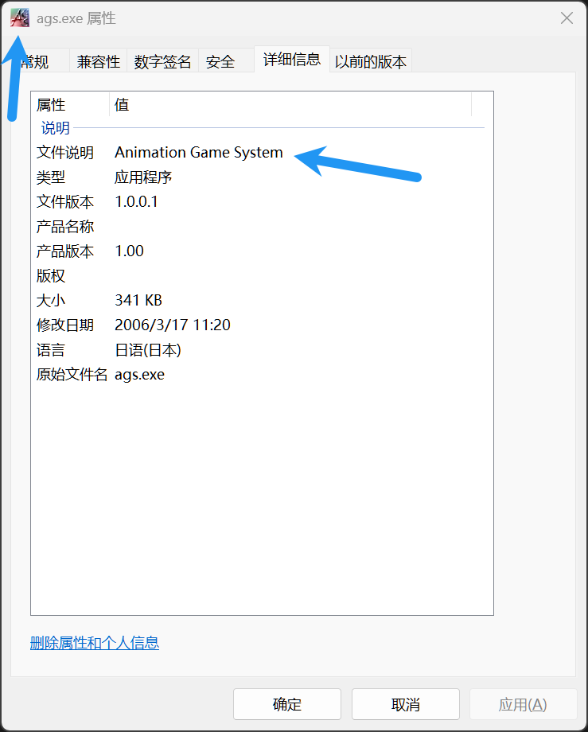
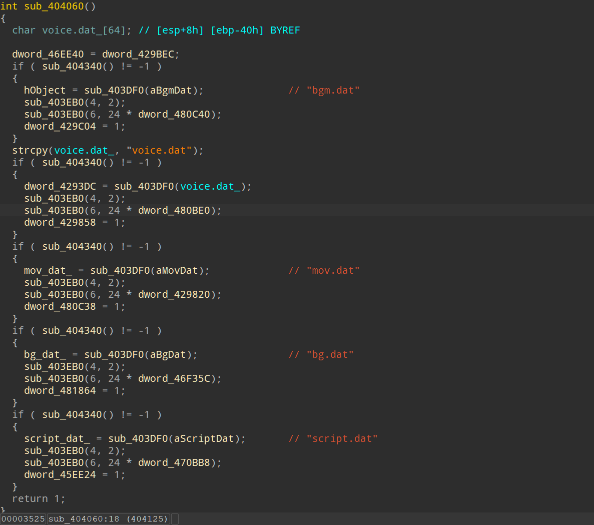

# How to find AGS scheme

## Check

1. Check if the game uses `AGS` engine.
   

2. Use `no encryption` scheme to unpack the archive to check if it is encrypted.

3. Use `DIE` to check if the game uses `ASProtect` protector.

## Instructions

1. Download `DecomAS` to unpack the `ASProtect` protector. I used `1.7 beta1` version.

2. Load the game's exe file with `IDA Pro` and find string `bg.dat`.

3. Find xref of the string and decompile the function.
   

4. Find xref of `bg_dat_` and check if it is like below:

```asm
.text:00404C00 mov edi, ds:_bg_dat_ ; "bg.dat"
.text:00404C06 lea esi, [eax+eax*2]
.text:00404C09 shl esi, 3
.text:00404C0C mov eax, ds:dword_485794[esi]
.text:00404C12 mov ecx, ds:dword_485790[esi]
.text:00404C18 push eax
.text:00404C19 push ecx
.text:00404C1A mov eax, ebp
.text:00404C1C call sub_403EB0
.text:00404C21 mov esi, ds:dword_485794[esi]
.text:00404C27 mov dl, 49h ; 'I'
.text:00404C29 push esi
.text:00404C2A push ebx
.text:00404C2B push ecx
.text:00404C2C or esi, 0FFFFFFFFh
.text:00404C2F inc esi
.text:00404C30 call sub_404C75
.text:00404C35 pusha
.text:00404C36 sahf
.text:00404C37
.text:00404C37 loc_404C37: ; CODE XREF: .text:00404C3E↓j
.text:00404C37 test eax, 0CF91C1D0h
.text:00404C3C cwde
.text:00404C3D dec edi
.text:00404C3E jz short near ptr loc_404C37+2
.text:00404C40 mov bl, 0B5h
.text:00404C42 mov esp, 0A35DF6B1h
.text:00404C47 xchg eax, esp
.text:00404C48 setalc
.text:00404C49 xor eax, 0DDDE95B2h
.text:00404C4E pop ebp
.text:00404C4F dec esp
.text:00404C50 mov ebp, ecx
.text:00404C52 cmc
.text:00404C53 xor eax, 0CE972090h
.text:00404C53 ; ---------------------------------------------------------------------------
.text:00404C58 db 0B8h
.text:00404C59 ; ---------------------------------------------------------------------------
.text:00404C59 ; START OF FUNCTION CHUNK FOR sub_404C75
.text:00404C59
.text:00404C59 loc_404C59: ; CODE XREF: sub_404C75+42↓j
.text:00404C59 xor ecx, ecx
.text:00404C5B test esi, esi
.text:00404C5D jle short loc_404C70
.text:00404C5F nop
.text:00404C60
.text:00404C60 loc_404C60: ; CODE XREF: sub_404C75-7↓j
.text:00404C60 mov bl, [ecx+eax]
.text:00404C63 xor bl, dl
.text:00404C65 add dl, 1Fh
.text:00404C68 mov [ecx+eax], bl
.text:00404C6B inc ecx
.text:00404C6C cmp ecx, esi
```

5. If the code is like above, you can see `mov dl, 49h` and `add dl, 1Fh` instructions. They are what we need.
