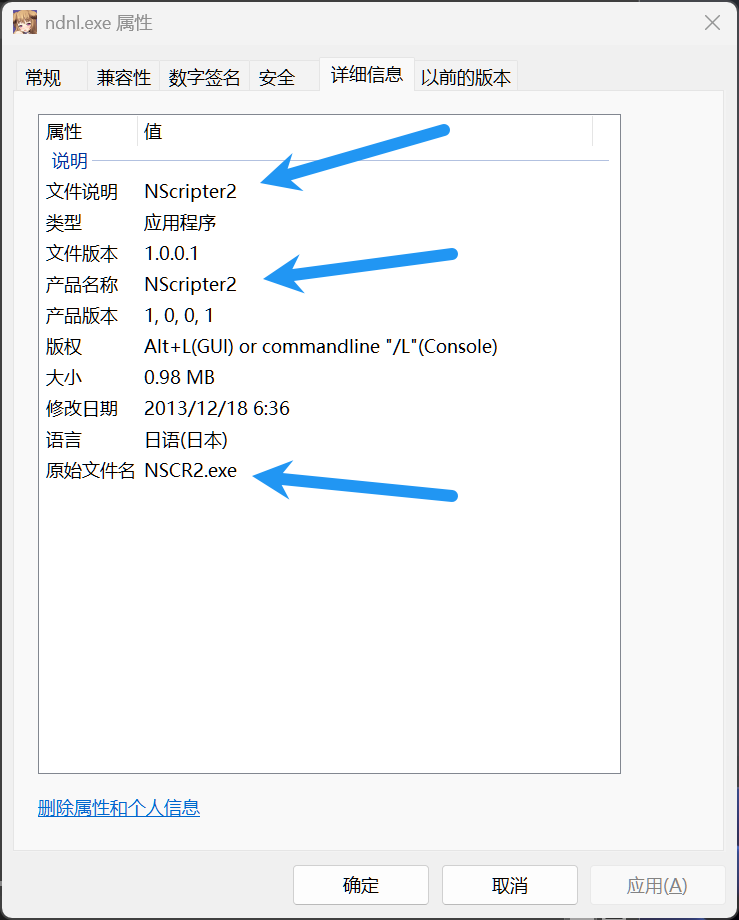
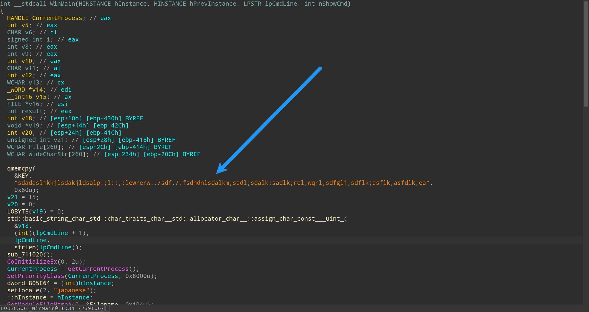

# How to find Nscripter ns2 scheme

## Check

1. Check the file extension: `.ns2`
2. Check if the game uses Nscripter2 engine

3. Check if the `ns2` archive is encrypted: use `GARbro` or `GalArc` to try extracting the archive

If the game meets the above conditions, then follow the instructions below.

## Instructions

1. Use `Detect It Easy` to check the game's protection
2. If no protection is found, use `IDA` directly to disassemble the game's exe file. You may notice the following string in `WinMain`:
    
Finally append the string to `Ns2.json`
3. If the game is protected by `Themida 2.xx-3.xx`, use some tools to bypass `alpharom` protection, and then use [Magicmida](https://github.com/Hendi48/Magicmida) to unpack the game's exe file. Finally follow step 2.