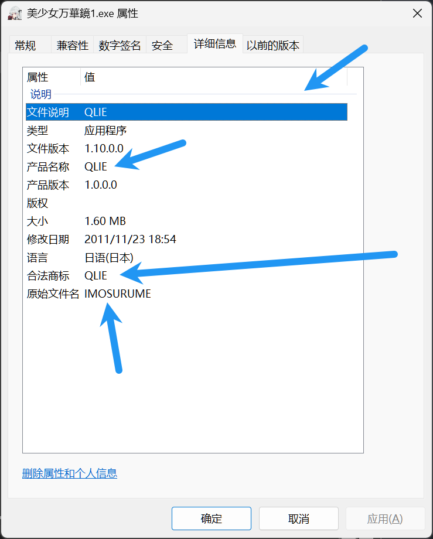
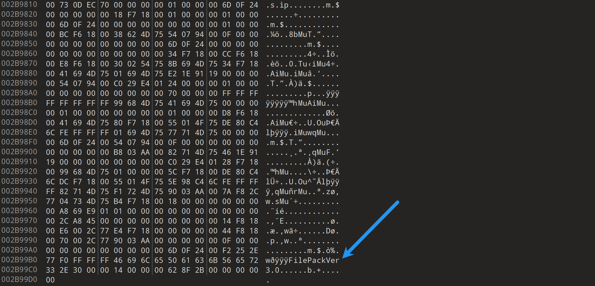
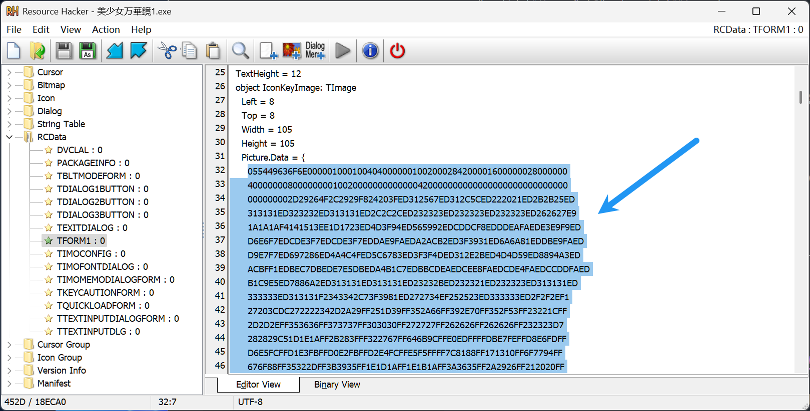
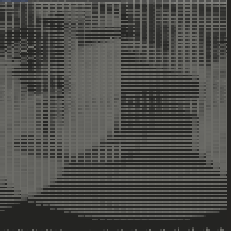
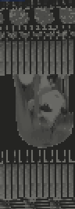

# How to find Qlie scheme

## Check

1. Check if the game uses Qlie engine



2. Check if the version of the archive is 3.0



If the game meets the above conditions, then follow the instructions below.

## Instructions

1. Download [ResHacker](https://www.angusj.com/resourcehacker/)
2. Open the game's exe file with ResHacker
3. Go to `RCData` -> `TFORM1`
4. Copy the contents in `Picture.Data` section
    
5. Remove all the "\n", "\r", and " " from the copied string
6. Convert the hex string to byte array and extract 0x100 bytes from offset 6
7. Compute the Base64 of the extracted bytes and append it to `Qlie.json`

## Sample code

```csharp
string a = "055449636F6E00000100";  // Replace this with the copied string
byte[] data = Convert.FromHexString(a);
byte[] output = new byte[0x100];
Buffer.BlockCopy(data, 6, output, 0, output.Length);
Console.WriteLine(Convert.ToBase64String(output));
```

## Fun fact

If you save `data` as a file and open it with a hex editor, you might see the game's logo.




