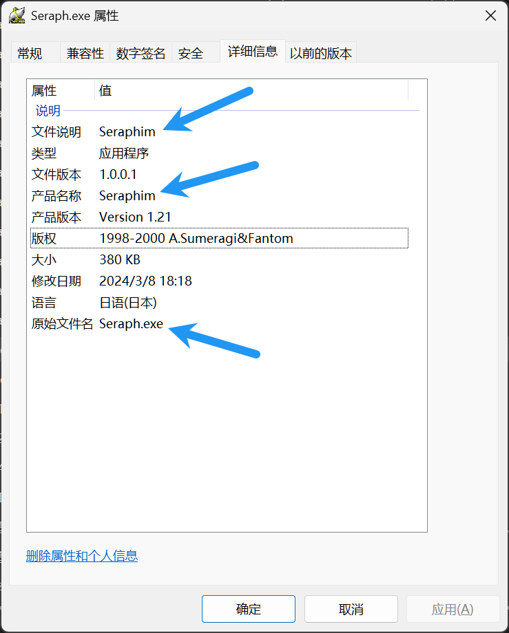

# How to find Seraph scheme

## Check

1. Check if the game uses Seraph engine

   

## Instructions

1. Load the game's exe file with `x64dbg` and stop at the entry point of the exe

2. Right-click on the disassembly window and select `Search for` -> `Current module` -> `String references`

3. Look for the string `ArchPac.Dat` and double-click on the address

4. Set a breakpoint at each address and run

5. When the breakpoint is hit, you can see `_llseek` function call like below

   ```assembly
   00407851 | 68 D0924400               | push seraph4.4492D0                                | LPCTSTR lpFmt = "ArchPac.Dat"
   00407856 | 51                        | push ecx                                           | LPTSTR lpOut
   00407857 | FF15 38324400             | call dword ptr ds:[<wsprintfA>]                    | wsprintfA
   0040785D | 83C4 08                   | add esp,0x8                                        |
   00407860 | 8D5424 1C                 | lea edx,dword ptr ss:[esp+0x1C]                    |
   00407864 | 57                        | push edi                                           | int iReadWrite
   00407865 | 52                        | push edx                                           | LPCSTR lpPathName
   00407866 | FF15 E0314400             | call dword ptr ds:[<_lopen>]                       | lopen
   0040786C | 8BD8                      | mov ebx,eax                                        |
   0040786E | 83FB FF                   | cmp ebx,0xFFFFFFFF                                 |
   00407871 | 75 0B                     | jne seraph4.40787E                                 |
   00407873 | 5F                        | pop edi                                            |
   00407874 | 33C0                      | xor eax,eax                                        |
   00407876 | 5B                        | pop ebx                                            |
   00407877 | 81C4 14030000             | add esp,0x314                                      |
   0040787D | C3                        | ret                                                |
   0040787E | 8B8424 20030000           | mov eax,dword ptr ss:[esp+0x320]                   |
   00407885 | 55                        | push ebp                                           |
   00407886 | 56                        | push esi                                           |
   00407887 | 57                        | push edi                                           |
   00407888 | 50                        | push eax                                           |
   00407889 | 53                        | push ebx                                           |
   0040788A | FF15 D0314400             | call dword ptr ds:[<_llseek>]                      |
   ```

6. Run to the `_llseek` function call and read the eax register. Append the value to `Seraph.json`
