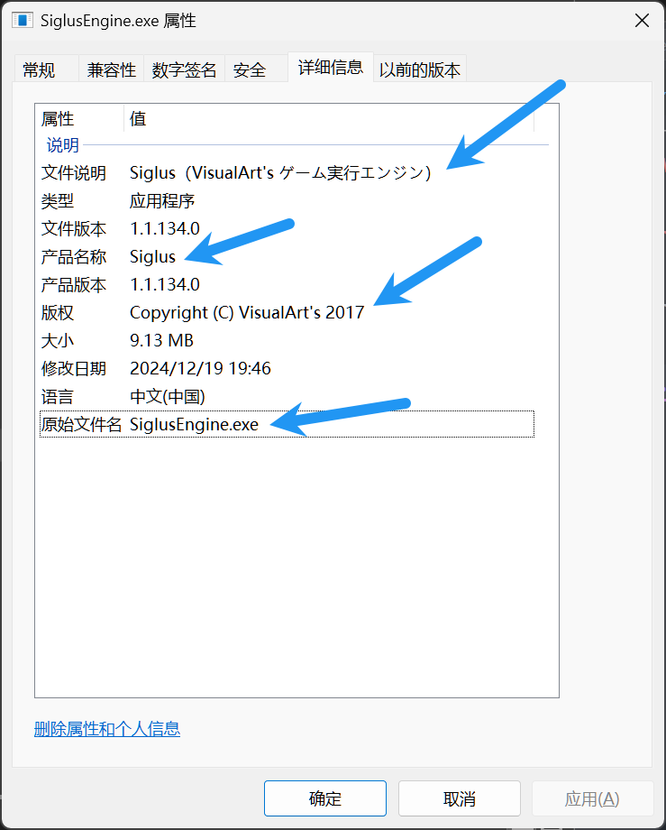

# How to find Siglus scheme

## Check

1. Check if the game uses Siglus engine



2. Check if the scheme of the game is already known in `Siglus.json`: Try extracting with `Try every encryption scheme` option in `GalArc`

If the game meets the above conditions, then follow the instructions below.

## Instructions

1. Load the game's exe file with `x64dbg` and stop at the entry point of the exe
2. Right-click on the disassembly window and select `Search for` -> `Current module` -> `String references`
3. Look for the string `Gameexe.dat` and double-click on the address
4. Set a breakpoint at the address and run
5. When the breakpoint is hit, click `F8` across multiple `mov` instructions and finally you will find the xor loop like below
```assembly
00DC09DE | 7E 23                     | jle siglusengine.DC0A03                            |
00DC09E0 | 8BDE                      | mov ebx,esi                                        |
00DC09E2 | 8A440D E0                 | mov al,byte ptr ss:[ebp+ecx-0x20]                  |
00DC09E6 | 8D52 01                   | lea edx,dword ptr ds:[edx+0x1]                     |
00DC09E9 | 3042 FF                   | xor byte ptr ds:[edx-0x1],al                       |
00DC09EC | 41                        | inc ecx                                            |
00DC09ED | 81E1 0F000080             | and ecx,0x8000000F                                 |
00DC09F3 | 79 05                     | jns siglusengine.DC09FA                            |
00DC09F5 | 49                        | dec ecx                                            |
00DC09F6 | 83C9 F0                   | or ecx,0xFFFFFFF0                                  |
00DC09F9 | 41                        | inc ecx                                            |
00DC09FA | 4B                        | dec ebx                                            |
00DC09FB | 75 E5                     | jne siglusengine.DC09E2                            |
00DC09FD | 8B85 E0FEFFFF             | mov eax,dword ptr ss:[ebp-0x120]                   |
00DC0A03 | 33C9                      | xor ecx,ecx                                        |
```
6. When you first execute the loop, stop at `mov al,byte ptr ss:[ebp+ecx-0x20]`. Right click on the address and select `Follow in dump` -> `Address: ebp+ecx-0x20`
7. You will see the xor key in the dump window. The length of the key is 0x10. Copy the key and append it to `Siglus.json`