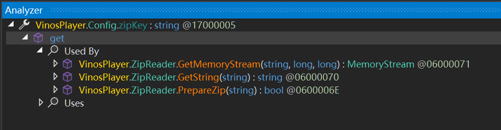
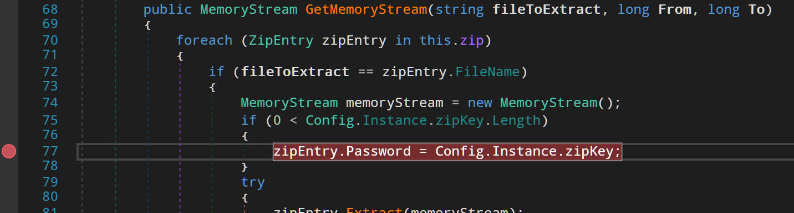
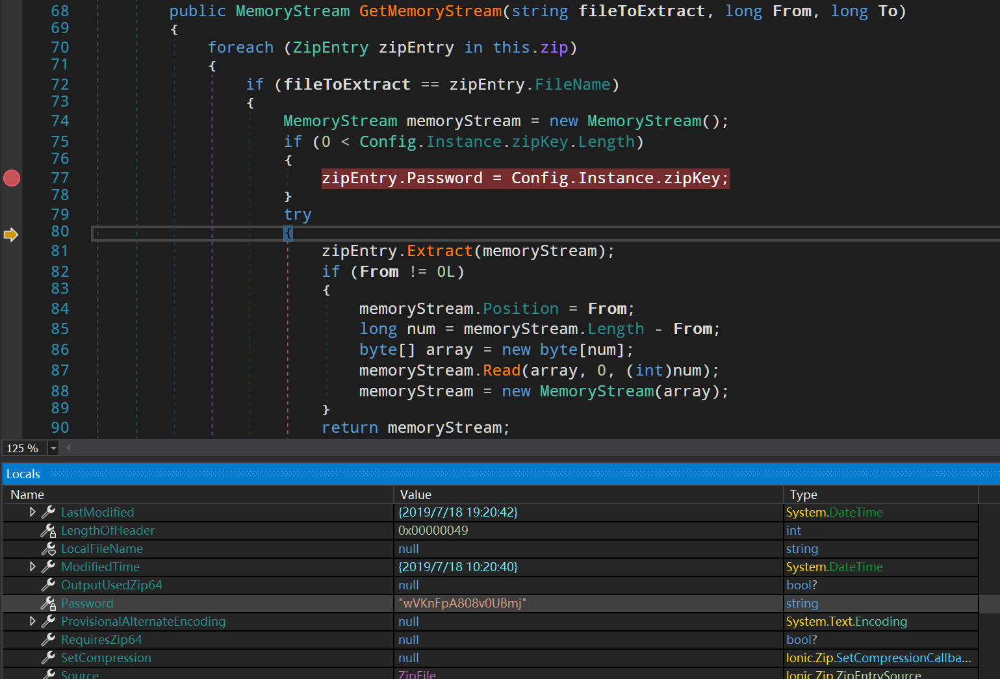

# How to find Vinos scheme

## Check

1. Check if the game uses Vinos engine

   Folder structure:

   ```
   │  cef.pak
   │  CefSharp.BrowserSubprocess.Core.dll
   │  CefSharp.BrowserSubprocess.exe
   │  CefSharp.Core.dll
   │  CefSharp.Core.xml
   │  CefSharp.dll
   │  CefSharp.WinForms.dll
   │  CefSharp.WinForms.XML
   │  CefSharp.XML
   │  cef_100_percent.pak
   │  cef_200_percent.pak
   │  cef_extensions.pak
   │  chrome_elf.dll
   │  config.exe
   │  d3dcompiler_47.dll
   │  data.ini
   │  data.pkg
   │  devtools_resources.pak
   │  DotNetZip.dll
   │  DotNetZip.xml
   │  icon.ico
   │  icudtl.dat
   │  libcef.dll
   │  libEGL.dll
   │  libGLESv2.dll
   │  license.txt
   │  log4net.dll
   │  log4net.xml
   │  MadMilkman.Ini.dll
   │  MadMilkman.Ini.xml
   │  natives_blob.bin
   │  Newtonsoft.Json.dll
   │  Newtonsoft.Json.xml
   │  snapshot_blob.bin
   │  unins000.dat
   │  unins000.exe
   │  uninst.exe
   │  v8_context_snapshot.bin
   │  vinos.log
   │  VinosPlayer.application
   │  VinosPlayer.exe
   │  VinosPlayer.exe.config
   │  VinosPlayer.exe.manifest
   │  widevinecdmadapter.dll
   │
   ├─locales
   │      am.pak
   │      ar.pak
   │      ...
   │
   └─swiftshader
        libEGL.dll
        libGLESv2.dll
   ```

   Or:

   ```
   │  cef.pak
   │  CefSharp.BrowserSubprocess.Core.dll
   │  CefSharp.BrowserSubprocess.exe
   │  CefSharp.Core.dll
   │  CefSharp.Core.xml
   │  CefSharp.dll
   │  CefSharp.WinForms.dll
   │  CefSharp.WinForms.XML
   │  CefSharp.XML
   │  cef_100_percent.pak
   │  cef_200_percent.pak
   │  cef_extensions.pak
   │  chrome_elf.dll
   │  CSLibrary.dll
   │  d3dcompiler_47.dll
   │  data.ini
   │  data.pkg
   │  devtools_resources.pak
   │  DotNetZip.dll
   │  DotNetZip.xml
   │  icon.ico
   │  icudtl.dat
   │  libcef.dll
   │  libEGL.dll
   │  libGLESv2.dll
   │  log4net.dll
   │  log4net.xml
   │  MadMilkman.Ini.dll
   │  MadMilkman.Ini.xml
   │  natives_blob.bin
   │  Newtonsoft.Json.dll
   │  Newtonsoft.Json.xml
   │  README.txt
   │  snapshot_blob.bin
   │  Steamworks.NET.dll
   │  steam_api.dll
   │  v8_context_snapshot.bin
   │  VinosWinPlayer.exe
   │  VinosWinPlayer.exe.config
   │  はじめにお読みください.txt
   │
   ├─locales
   │      am.pak
   │      ar.pak
   │      ...
   │
   ├─Player
   │      player.pkg
   │
   └─swiftshader
           libEGL.dll
           libGLESv2.dll
   ```

## Extract

The engine has 2 versions. The first version doesn't contain Player/player.pkg file, and the executable file is named `VinosPlayer.exe`. The second version contains Player/player.pkg file, and the executable file is named `VinosWinPlayer.exe`.

### V1

1. Decompile `VinosPlayer.exe` with dnSpy x86.

2. Find `Config` class in `VinosPlayer` namespace.

3. Find `zipKey` property and analyze it.

   

4. Go to `GetMemoryStream` method and add a breakpoint.

   

5. Run the game and wait for the breakpoint to hit. Then check the `Password` property of `zipEntry`.

   

### V2

1. Decompile `CSLibrary.dll` with ILSpy.

2. Find `Config` class in `CSLibrary` namespace.

3. Find `Load` method. Decompiled code:

   ```csharp
   public bool Load(string filename)
   {
      IniFile iniFile = new IniFile(new IniOptions
      {
            EncryptionPassword = DefaultEncKey,
            Encoding = Encoding.UTF8
      });
      if (iniFile == null)
      {
            return false;
      }
      try
      {
            iniFileName = filename;
            iniFile.Load(filename);
            IniSection iniSection = iniFile.Sections["Product"];
            if (iniSection != null)
            {
               if (iniSection.Keys.Contains("name"))
               {
                  name = iniSection.Keys["name"].Value;
               }
               if (iniSection.Keys.Contains("version"))
               {
                  version = iniSection.Keys["version"].Value;
               }
               if (iniSection.Keys.Contains("updateURL"))
               {
                  updateURL = iniSection.Keys["updateURL"].Value;
               }
               if (iniSection.Keys.Contains("updateUseAuth"))
               {
                  updateUseAuth = iniSection.Keys["updateUseAuth"].Value == "1";
               }
               if (iniSection.Keys.Contains("updateUserID"))
               {
                  updateUserID = iniSection.Keys["updateUserID"].Value;
               }
               if (iniSection.Keys.Contains("updateUserPwd"))
               {
                  updateUserPwd = iniSection.Keys["updateUserPwd"].Value;
               }
               if (iniSection.Keys.Contains("manifest"))
               {
                  manifest = iniSection.Keys["manifest"].Value;
               }
               if (iniSection.Keys.Contains("manifestKey"))
               {
                  manifestKey = iniSection.Keys["manifestKey"].Value;
               }
               if (iniSection.Keys.Contains("cacheDir"))
               {
                  cacheDir = iniSection.Keys["cacheDir"].Value;
               }
               if (iniSection.Keys.Contains("useDocument"))
               {
                  useDocument = iniSection.Keys["useDocument"].Value == "1";
               }
               if (iniSection.Keys.Contains("iconFile"))
               {
                  iconFile = iniSection.Keys["iconFile"].Value;
               }
            }
            IniSection iniSection2 = iniFile.Sections["Content"];
            if (iniSection2 != null)
            {
               if (iniSection2.Keys.Contains("file"))
               {
                  contentFile = iniSection2.Keys["file"].Value;
               }
               if (iniSection2.Keys.Contains("key"))
               {
                  contentKey = iniSection2.Keys["key"].Value;
               }
               if (iniSection2.Keys.Contains("folder"))
               {
                  contentDir = iniSection2.Keys["folder"].Value;
               }
               if (iniSection2.Keys.Contains("infoFile"))
               {
                  contentInfo = iniSection2.Keys["infoFile"].Value;
               }
            }
            IniSection iniSection3 = iniFile.Sections["Player"];
            if (iniSection3 != null)
            {
               if (iniSection3.Keys.Contains("file"))
               {
                  playerFile = iniSection3.Keys["file"].Value;
               }
               if (iniSection3.Keys.Contains("key"))
               {
                  playerKey = iniSection3.Keys["key"].Value;
               }
               if (iniSection3.Keys.Contains("startFile"))
               {
                  playerStart = iniSection3.Keys["startFile"].Value;
               }
               if (iniSection3.Keys.Contains("version"))
               {
                  playerVersion = iniSection3.Keys["version"].Value;
               }
            }
            IniSection iniSection4 = iniFile.Sections["Steam"];
            if (iniSection4 != null)
            {
               if (iniSection4.Keys.Contains("steamAppId"))
               {
                  steamAppId = iniSection4.Keys["steamAppId"].Value;
               }
               if (iniSection4.Keys.Contains("useSteam"))
               {
                  useSteam = iniSection4.Keys["useSteam"].Value == "1";
               }
            }
      }
      catch (FileNotFoundException ex)
      {
            log.Error($"Failed to startup : Missing File={filename}, Error={ex.Message}");
            return false;
      }
      return true;
   }
   ```

   `DefaultEncKey` is a constant string defined in the class.

4. Write a simple C# program to decrypt the data.ini file using MadMilkman.Ini library.

   ```csharp
   using MadMilkman.Ini;
   using System.Text;

   internal static class Program
   {
      private static void Main(string[] args)
      {
         if (args.Length != 1)
         {
               Console.WriteLine("Usage: VinosExt <path_to_ini_file>");
               return;
         }
         Console.WriteLine("Input DefaultEncKey:");
         string default_key = Console.ReadLine();
         IniFile iniFile = new(new IniOptions
         {
               EncryptionPassword = default_key,
               Encoding = Encoding.UTF8
         });
         iniFile.Load(args[0]);
         IniSection sec_content = iniFile.Sections["Content"];
         IniSection sec_player = iniFile.Sections["Player"];
         Console.WriteLine($"Content key: {sec_content.Keys["Key"].Value}");
         Console.WriteLine($"Player key: {sec_player.Keys["Key"].Value}");
      }
   }
   ```
